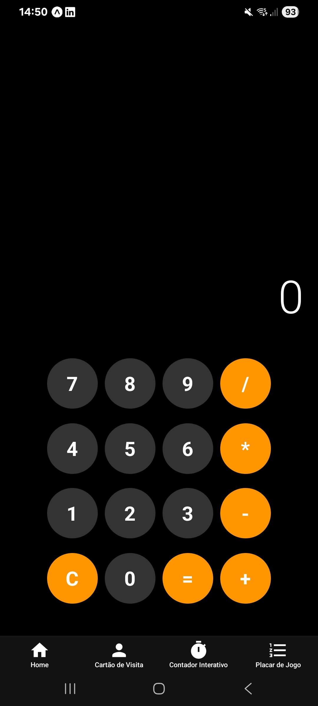
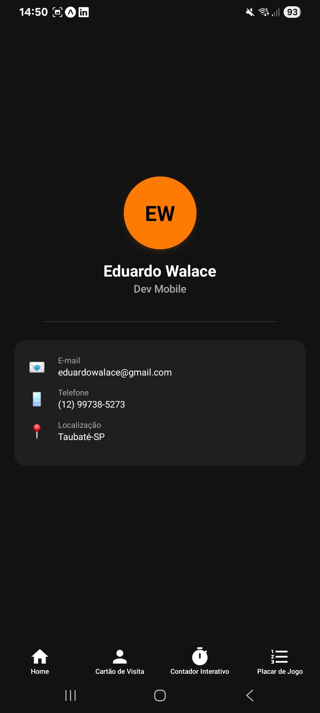
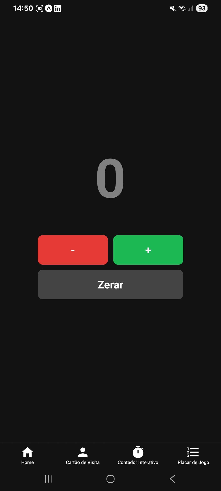
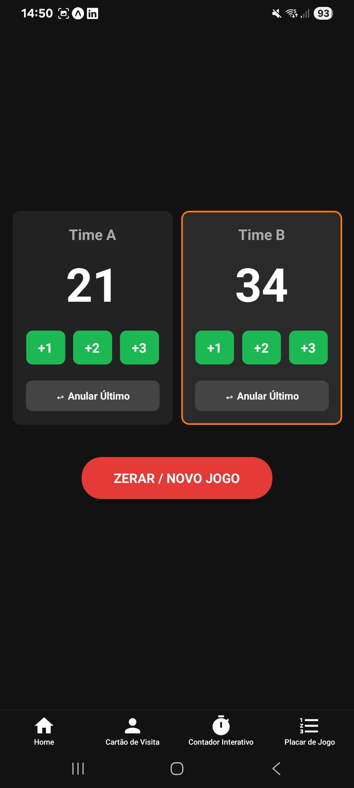

# 📱 Projetos Práticos - React Native

Repositório contendo uma coleção de aplicativos mobile desenvolvidos com React Native e Expo. Estes projetos fazem parte das atividades práticas e do meu desenvolvimento técnico no curso de Análise e Desenvolvimento de Sistemas no Senai.

## 🚀 Aplicativos Desenvolvidos

Este repositório consolida 4 projetos focados na construção de interfaces e manipulação de estado (`useState`):

* **🧮 Calculadora:** Aplicativo de cálculo com interface limpa e responsiva.
* **🪪 Cartão de Visita:** Tela de perfil profissional utilizando componentes reutilizáveis (`InfoItem`) e estilização condicional.
* **🔢 Contador Interativo:** Aplicativo de contagem com mudança dinâmica de cores baseada no valor atual (positivo, negativo ou neutro).
* **⚽ Placar de Jogo (Desafio):** Placar eletrônico completo para dois times, contendo histórico de pontuação, botão de anular o último ponto e destaque visual automático para o time vencedor.

## 📸 Telas dos Aplicativos

<p align="center">
  
  
  
  
</p>

## 🛠️ Tecnologias Utilizadas

* **React Native:** Biblioteca principal para construção da interface mobile.
* **Expo:** Framework que facilita o desenvolvimento, build e testes no dispositivo físico.
* **TypeScript:** Adição de tipagem estática (como as `Props` nos componentes) para um código mais seguro.

## ⚙️ Como executar o projeto

1. Clone este repositório:
   ```bash
   git clone [https://github.com/EduardoWalace/NOME_DO_SEU_REPOSITORIO.git](https://github.com/EduardoWalace/NOME_DO_SEU_REPOSITORIO.git)
Instale as dependências:

Bash
npm install
Inicie o servidor do Expo:

Bash
npx expo start
Escaneie o QR Code gerado no terminal com o aplicativo Expo Go no seu celular (Android ou iOS).

Desenvolvido com dedicação por Eduardo Walace. 🚀
